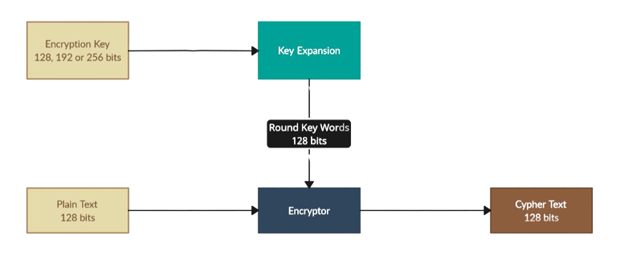
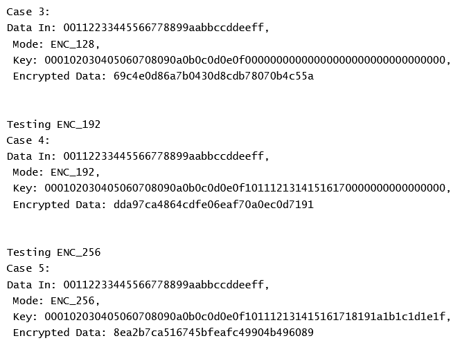
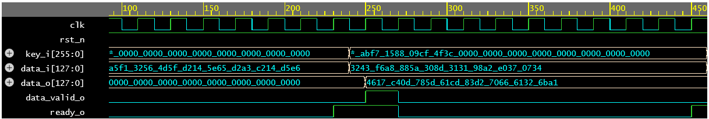

# Multi-Cycle-AES-Encryption
Multi-Cycle AES Encryption Implementation (128, 192 &amp; 256 bit Key Lengths) Using SystemVerilog

#### Modes Included:
- NOOP: Halts the Operation of the Module Preserving the State.
- 128-bit key encryption.
- 192-bit key encryption.
- 256-bit key encryption.

The System has an Active Low Synchronous Reset.
#### Design Overview

- The Key Expansion Module generates the required Key Words for each round with each edge of the Clock.
- The Encryptor takes the Key Words and Operates on the Plain Text provided to generate the Cypher Text. It also provide two additional signals:
  - Ready Signal: Which indicates that the Module can take the next plain text on the edge of the next cycle. This signal is also present whenever the module is idling.
  - Data Valid Signal: Which is generated when the Cypher Text is Ready on the Output Bus.

- The Mode Input takes one of four values:
   - 0: Indicating No Operation.
   - 1: 128-bit key encryption.
   - 2: 192-bit key encryption.
   - 3: 256-bit key encryption.
 
     
- Number of Cycles for Each Encryption Mode:
   - 128-bit key encryption: 1 Pre-Round + 10 Rounds (Total of 11).
   - 192-bit key encryption: 1 Pre-Round + 12 Rounds (Total of 13).
   - 256-bit key encryption: 1 Pre-Round + 14 Rounds (Total of 15).

#### Simulation Snippet
Log Output 

Simulation Waveform Snippet

#### For A Better View of Simulation Results, Check The Following EdaPlayground:
   https://edaplayground.com/x/Usss

#### Main References:
  - FIPS 197, Advanced Encryption Standard Documentation.
  - "A Very Compact Rijndael S-box", David Canright.
  - "Introduction To Cryptography And Network Security", Behrouz A. Forouzan.
